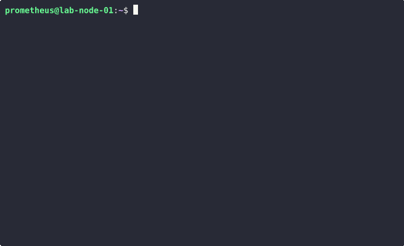
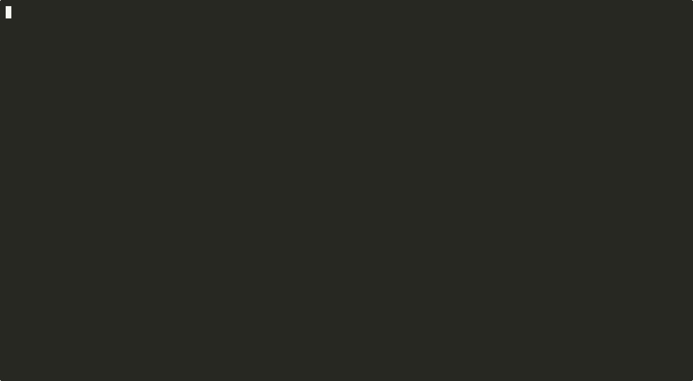
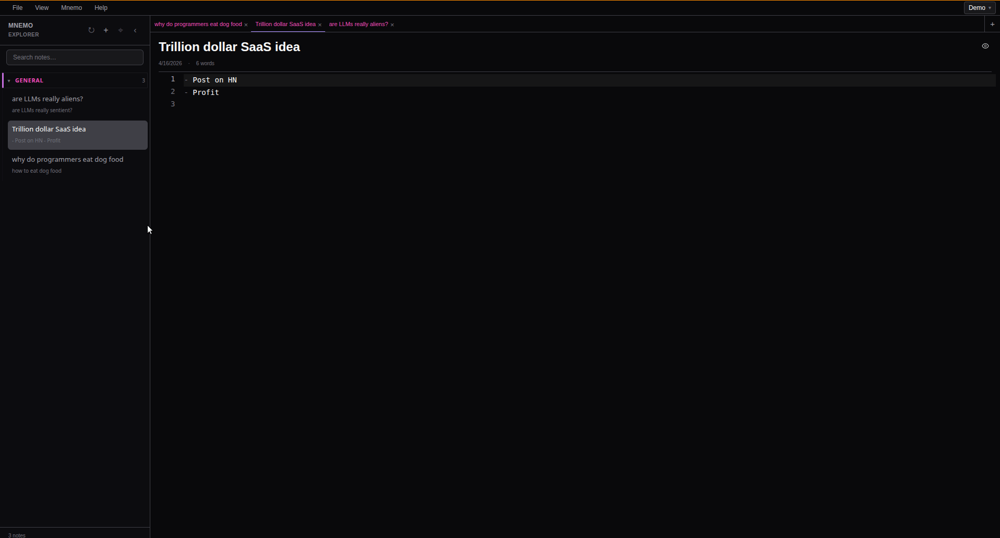
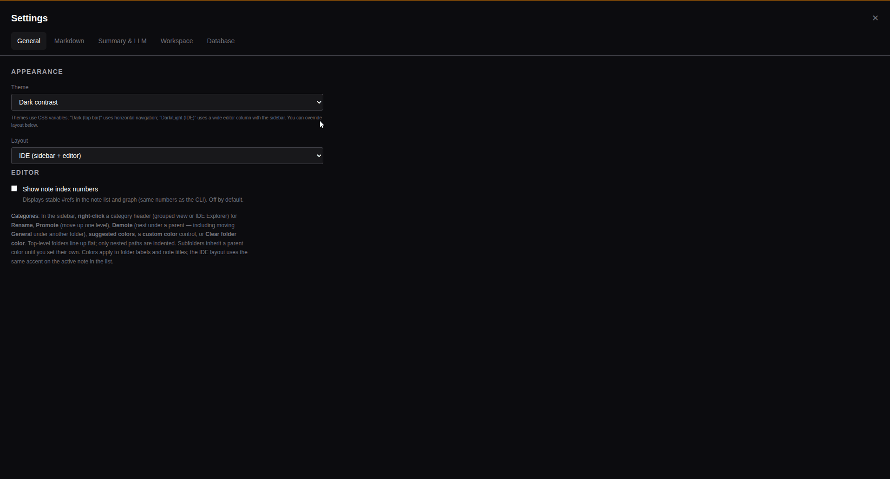

# Mnemo

A local-first notebook you can query from the terminal, the desktop, or over **MCP** — with optional **libSQL** (Turso or self-hosted) so the same vault syncs everywhere.

## Why this exists

Most note tools fail when you need to:

- capture something quickly mid-workflow
- find it again reliably
- reuse it from scripts, agents, or IDEs

Mnemo keeps a **stable ref** per note, **full-text search**, **wikilinks**, and a **category/folder** model (first tag = path). Data lives in **SQLite** locally with a **markdown mirror** under your vault directory, or in **remote libSQL** when you configure it.

## Features

- **Desktop app (Electron)** — Markdown editor, graph, **IDE layout with editor tabs** as the default (classic sidebar and top layouts in Settings), remote DB in Settings with **upload + download** (additive sync), background vault sync + manual reload (Turso), **F11** fullscreen on Linux/Windows; optional **spell check**, **autocomplete** (fenced code languages and wikilinks), and **Copy/Paste as summary** via locally configured LLM profiles (see **Help → Documentation**)
- **CLI** — `mnemo note …` for list/search/show/new/import, compose/edit in `$EDITOR`, categories, link graph, autolink; **`mnemo sync push` / `mnemo sync pull`** for additive merges with libSQL (see `mnemo help sync`); interactive list pager scrolls with selection
- **MCP** — stdio server (`mnemo mcp`) for Cursor / Claude Desktop (list/categories/ref-based tools, autolink, etc.); HTTP/SSE (`mnemo mcp-http`) for remote libSQL + bearer auth
- **Optional cloud** — same credentials in GUI Settings or env vars for CLI/MCP

## Examples (CLI)






```bash
npm install -g mnemo-note
mnemo note list
mnemo note search "your query"
mnemo note new --title "Hello" --body "Markdown **here**." -c General
mnemo note show 1
```

Use **`-g`** so **`mnemo`** (and **`mnemo-note`**) are on your **`PATH`**. A **local** install (`npm install mnemo-note` without `-g`) only adds **`node_modules/.bin/`** — run **`npx mnemo`**, **`npx mnemo-note`**, or **`./node_modules/.bin/mnemo`** from that directory.

`ref` in `show` is the **#** column from `note list` (not arbitrary IDs). See `**mnemo --help`** for every subcommand.

## Prerequisites

- **Node.js** 22 or newer (required for this repo’s dependency tree, including Mermaid’s parser stack). GitHub Actions already use Node 22. With [nvm](https://github.com/nvm-sh/nvm), run `nvm use` in the repo root (see `.nvmrc`).

## Examples (desktop)





```bash
git clone https://github.com/fwgadmin/mnemo.git
cd mnemo
npm install
npm start
```

`npm install` runs a native rebuild so `better-sqlite3` matches **Electron** (the `mnemo` CLI uses Electron’s Node). If you skipped it, run `npm run rebuild:native`. To opt out of the postinstall step (e.g. CI), set `MNEMO_SKIP_NATIVE_REBUILD=1`.

Installers: [GitHub Releases](https://github.com/fwgadmin/mnemo/releases) — **Windows** and **Linux** zips for tagged `**v***` builds. **macOS desktop installers are not published**; on macOS use **`npm install -g mnemo-note`** (CLI) or run **`npm start`** from a source checkout.

## Mobile app (Expo) - In Development

To Be Shipped: Native iOS / Android lives under **`apps/mnemo-mobile`**. From the **repo root**, `npm run mobile:start:dev`, `npm run eas:dev:ios`, `npm run eas:build:ios`, etc. forward into that package. Use **`eas-cli`** (via those scripts), not the unrelated npm package **`eas`**. See **[apps/mnemo-mobile/README.md](apps/mnemo-mobile/README.md)**.

## Documentation


| Resource                                         | Contents                                                                                                                                              |
| ------------------------------------------------ | ----------------------------------------------------------------------------------------------------------------------------------------------------- |
| **Help → Documentation** (in the app)            | Full GUI help: notes, wikilinks, categories, MCP tables, shortcuts                                                                                    |
| `**mnemo --help`**                               | Same facts as in-app documentation (paths, MCP resources/tools/prompts, note commands) — source: `[src/shared/userGuide.ts](src/shared/userGuide.ts)` |
| **[examples/](examples/README.md)**              | CLI local / libSQL, MCP stdio & HTTP, GUI + shared config                                                                                             |
| **[docs/CODE_SIGNING.md](docs/CODE_SIGNING.md)** | Windows signing: Azure Artifact Signing in CI (preferred), PFX fallback, or local Trusted Signing (`make:win:trusted`)                              |


## Using Mnemo with AI

- **MCP stdio** — add `mnemo` / `mcp` to your IDE’s MCP config ([examples/mcp-stdio.md](examples/mcp-stdio.md))
- **MCP HTTP** — for hosted setups with Turso + API key ([examples/mcp-http.md](examples/mcp-http.md))
- **Deterministic refs** — cite `ref` or titles in prompts; no vector DB required
- **Desktop summarization** — the GUI can send selected or clipboard text to OpenAI-compatible APIs, Ollama, Anthropic, or Gemini using **Settings → Summary & LLM**; keys stay in `llm-config.json` under app data. Use **Ctrl+Shift+C/V** in the note editor for plain summaries (when configured), **Ctrl+Alt+C/V** for Markdown-formatted summaries; **Ctrl+Shift+V** still toggles Markdown preview when summarization does not apply (see **Help → Documentation**)

## Philosophy

- Small surface area, batteries included for Markdown + links + search
- Same vault from GUI, CLI, and MCP when credentials align

## Status

Actively developed. Issues and PRs welcome.

## Contributing

PRs, issues, and feedback are welcome.

## About

Mnemo is built and maintained by [Ferrowood Group, LLC](https://www.ferrowoodgroup.com).

## License

This project is open source under the [MIT License](LICENSE). The same terms apply to the npm package `**mnemo-note`**.

---

MIT © [Ferrowood Group, LLC](https://www.ferrowoodgroup.com)
